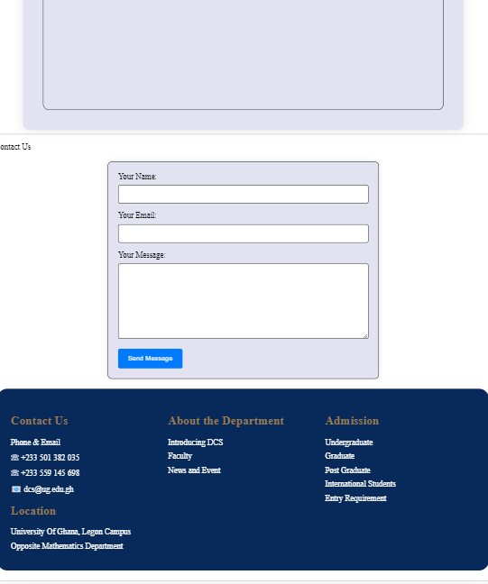

# 11173490 DCIT_205_IA
 Lartey Keren Kuma 111734904
 # A brief introduction and the purpose of the website
 The website I am building is the Department of Computer Science of the University of Ghana.
 The University of Ghana's Department of Computer Science website acts as a multipurpose central internet hub. 
 It serves as a hub for information, offering facts on academic offerings, professors, courses, and admission requirements. 
 The website also disseminates updates, news, and announcements related to departmental activity. Academic resources, such as syllabuses, relevant tools, and course content, are available to teachers and students. 
 In order to promote cooperation among academics, the platform also showcases publications, ongoing initiatives, and research endeavors. In order to promote communication, community involvement, and networking possibilities, contact data for department members, an events calendar, alumni information, and support services are also available. In conclusion, the website provides thorough information for the Computer Science department and acts as an essential online presence that links students, teachers, and stakeholders.
 
 # Detailed instructions on how to clone and set up the project.
 Install Git:

Download and install Git from Git Downloads.
Open Visual Studio Code:

Launch Visual Studio Code on your computer.
Open Terminal:

Open the integrated terminal in Visual Studio Code (View -> Terminal or `Ctrl + ``).
Navigate to the Desired Directory:

Use the cd command in the integrated terminal to navigate to the directory where you want to store the website.
Clone the Repository:

Clone the Computer Science Department website repository using the git clone command.
Navigate into the Project Directory:

Move into the newly cloned project directory.
Install Dependencies:

If the website has dependencies, install them using a relevant package manager.
Configuration (Optional):

Check the project's documentation for any specific configuration settings.
Verify the Setup:

Confirm that the project files are present in the directory.
Start Working:

Open the project in Visual Studio Code using the appropriate command.
Begin working on the website by editing files in the code editor.
Update the Project:

Regularly update your local copy with changes from the remote repository using the integrated terminal.

# SCREENSHOTS OF WEBSITE
# HOME
()
()
()

# ABOUT

# ADMISSION

# EVENTS

# FACULTY

# CONTACT US

# SHORT COURSES

# UNDERGRAD

# GRAD -MPHIL/MSC

# WHAT I LEARNT
I have learnt how to debug code 
I also learnt the important skill of using git
I also improved my skill in html and css

